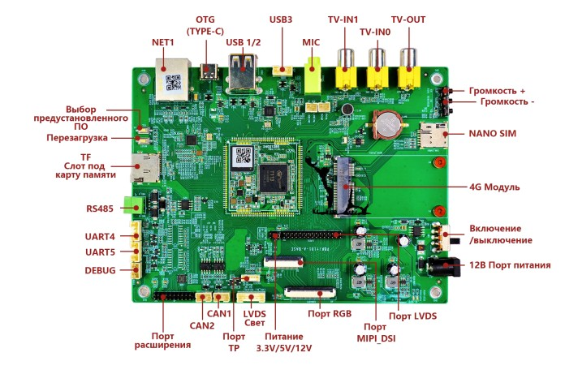
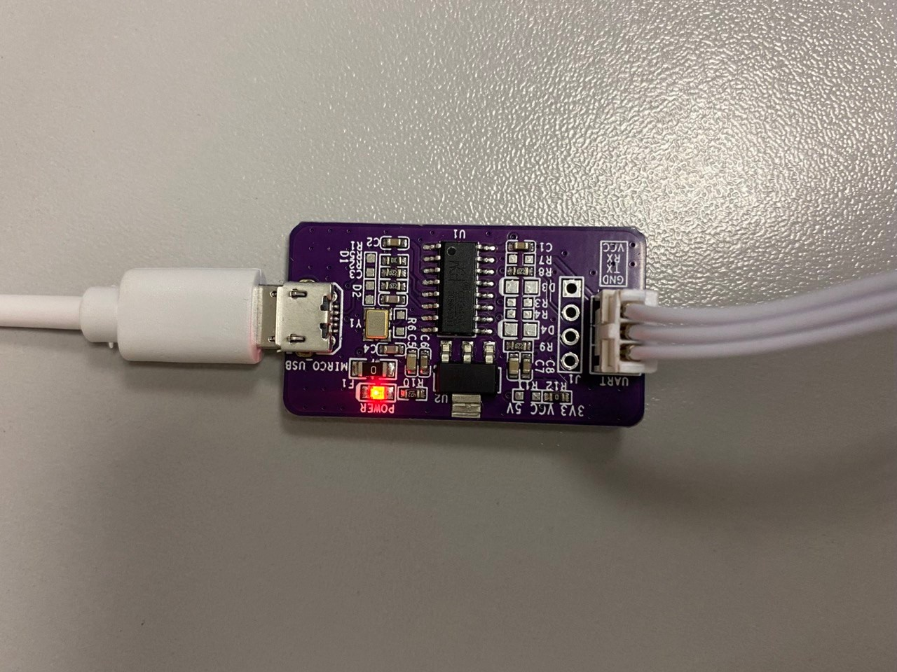
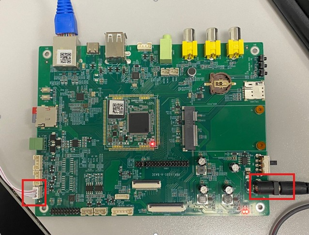
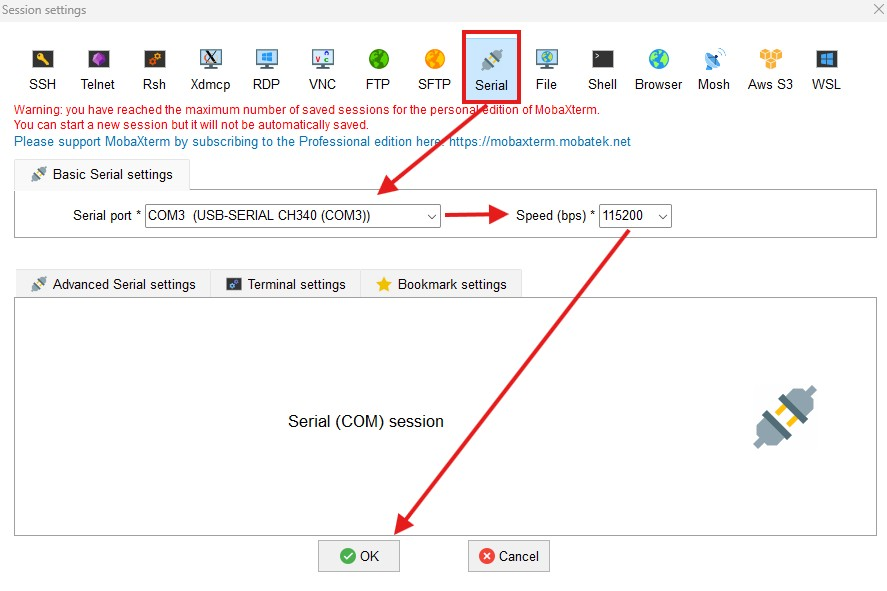

# PBkit_series
В этом разделе мы расскажем Вам об уникальных платах, способных расширить Ваши горизонты влияния во встраиваемых системах управления, интеллектуальных системах и многом другом. Скорее открывайте, читайте и знакомьтесь с нашей продукцией.
# PBKIT101-A



## Обзор
PBKIT101-A — отладочная плата на базе процессора **Allwinner T113-S3**.  
Предназначена для встраиваемых систем, автоматизации, промышленных и мультимедийных задач. Работает под управлением Linux (Tina / OpenWRT), загрузка через U-Boot. Поддерживает подключение дисплеев, USB, CAN, UART, SPI и другие интерфейсы.

---

## Ключевые возможности
- Энергоэффективный двухъядерный процессор ARM Cortex-A7 до 1.0 ГГц  
- Оперативная память DDR3 до 128 МБ  
- Поддержка microSD, SPI-NAND и eMMC  
- Сетевой интерфейс Ethernet 10/100 Мбит/с  
- USB Host (Type-A) и USB OTG (Type-C)  
- 2× CAN (требуются внешние трансиверы)  
- 4× UART (включая RS-485 и отладочный порт)  
- SPI×3, I²C×2, ADC (12-бит, до 4 каналов)  
- GPIO с возможностью расширения через XL9555 (I²C)  
- Видео: LVDS, MIPI-DSI, RGB + FPC-коннектор для тачскрина  
- Аудио: встроенный кодек, 3.5 мм выход и вход для микрофона  

---

## Технические характеристики

| Параметр             | Значение                                                      |
| -------------------- | ------------------------------------------------------------- |
| **Процессор**        | Allwinner T113-S3                                             |
| **Архитектура**      | ARMv7-A (32-бит)                                              |
| **Ядра**             | 2× Cortex-A7 до 1.0 ГГц                                       |
| **ОС**               | Linux (Tina / OpenWRT), загрузка через U-Boot                 |
| **ОЗУ**              | 64–128 МБ DDR3                                                |
| **Память**           | microSD (TF), SPI-NAND, eMMC (опционально)                    |
| **Ethernet**         | 10/100 Мбит/с                                                 |
| **USB**              | 1× Host (Type-A), 1× OTG (Type-C)                             |
| **CAN**              | 2 канала (внешний трансивер)                                  |
| **UART**             | 4 порта (вкл. отладка, RS-485)                                |
| **SPI / I²C**        | SPI0–2, I²C0–1                                                |
| **ADC**              | 12-бит, до 4 каналов, ~5–10 кГц                               |
| **GPIO**             | Расширяемый через XL9555 (I²C)                                |
| **Видео**            | LVDS, MIPI-DSI, RGB; тачскрин через FPC                       |
| **Аудио**            | Встроенный аудиокодек; выход 3.5 мм, вход для микрофона      |

---

## Применение
- **Промышленная автоматизация**  
  Подключение датчиков, актуаторов, операторских панелей через CAN, UART, SPI, GPIO.  
- **Терминалы и пользовательские интерфейсы**  
  Дисплеи и тачскрины через LVDS/MIPI-DSI/RGB + FPC.  
- **Контроллеры и логика управления**  
  Два ядра и поддержка реального времени для сервисов мониторинга и защиты.  
- **Аудиосистемы**  
  Голосовое оповещение, диктофоны, плееры на базе встроенного кодека.  
- **IoT и сетевые шлюзы**  
  Ethernet, USB, CAN — основа для межпротокольных шлюзов.  
- **Образовательные проекты и R&D**  
  Открытая архитектура и Linux-сборка Tina/OpenWRT для обучения и прототипирования.

---

## Начало работы
1. Подключите питание и интерфейсы (Ethernet, USB, дисплей).  
2. Загрузитесь с microSD или eMMC через U-Boot.  
3. Войдите по UART или SSH, настройте окружение и приложения.  

---

> **Примечание:** для гарантированно стабильной работы в промышленных условиях рекомендуется использовать качественный источник питания и при необходимости подключить корпус платы к защитному заземлению.


> # Инструкция по «компиляции» и запуску кода на PBKIT101-A

---

## 1. Требования

- TTL-модуль  
- USB-кабель  
- Штырьковая линия с шагом 1,27 мм  

---

## 2. Подключение платы по Serial

Необходимые и достаточные соединения (TTL ↔ PBKIT101-A ↔ USB-порту компьютера):  
Схема подключения TTL

  

Схема подключения переферии



---

## 3. Открытие терминала в MobaXterm

1. Установите **MobaXterm Home Edition v24.2**.  
2. Нажмите кнопку интерфейса для открытия настроек COM-порта.  
3. Выставьте параметры порта:  
   - Скорость: **115200**  
   - Формат: **8 N 1**  
4. Откройте терминал.  

  

---

## 4. Проверка установленного Python

В терминале введите команду:

```bash
python --version

Выведет строку, например, у нас так (и соотвественно Вашу версию):
```bash
Python 3.8.10

В том же терминале выполните:
```bash
python first_project.py

Вы увидите в выводе:
```bash
Hello World!

*Примечание. Несмотря на название «компиляция», в данном случае код на Python интерпретируется напрямую без явного этапа сборки.
Если на вашей системе нужно явно вызывать python3, замените python на python3 во всех командах.*

